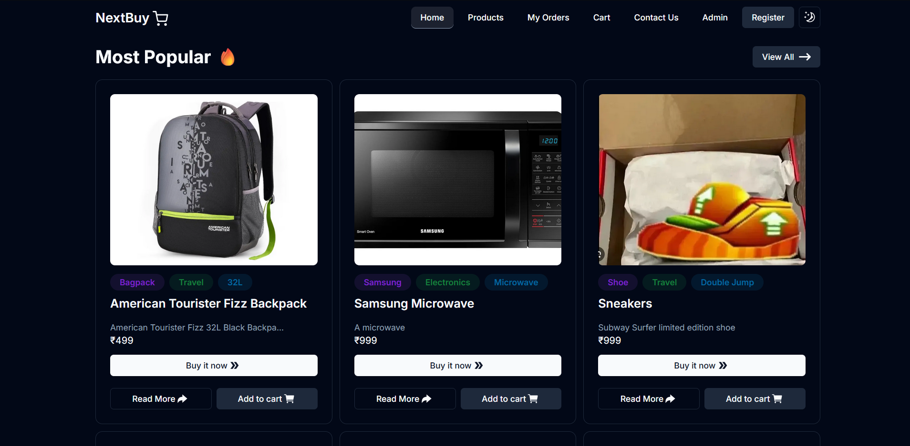
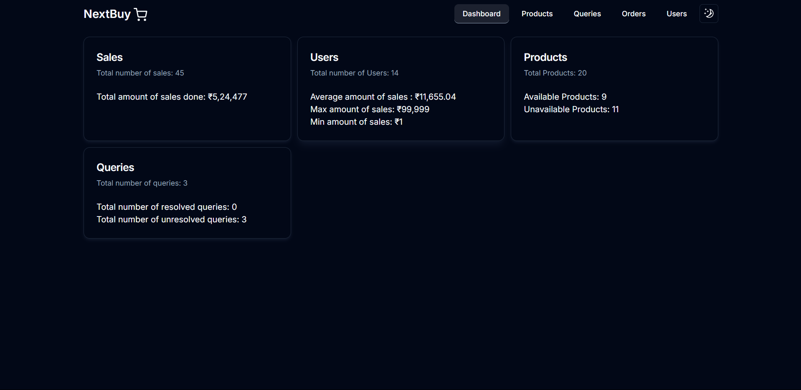

# E-Commerce Platform






## Description

This project is an e-commerce platform built using Next.js, TypeScript, and MongoDB. It provides a seamless shopping experience for users along with a admin dashboard for efficient management of products, orders, users, and contacts.

## Features

- **Admin Dashboard**: Manage products, orders, users, and contacts efficiently.
- **User Authentication**: Secure login and registration using NextAuth.
- **Payment Integration**: Payments are processed via Stripe.
- **Email Notifications**: Automated emails sent using Nodemailer.
- **Image Upload**: Images uploaded using Cloudinary.

## Tech Stack

- **Frontend**: Next.js, TypeScript, TailwindCSS, Shadcn UI
- **Backend**: Node.js, Prisma, NextAuth, Nodemailer
- **Database**: MongoDB
- **Other Libraries**: Zustand, react-email

## Installation

1. Clone the repository:

```bash
git clone https://github.com/yourusername/e-commerce.git
```

2. Install dependencies:

```bash
cd e-commerce
npm install
```

3. Create a `.env.local` file in the root directory and add the following environment variables:

```bash
cp .env.sample .env.local
```

4. Start the development server:

```bash
npm run dev
```

5. Open [http://localhost:3000](http://localhost:3000) to view it in the browser.

## Contact

For inquiries or feedback, feel free to reach out:

- Email: shubhamsisodia84@gmail.com
